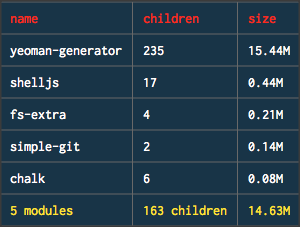
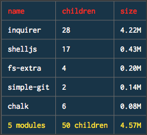

### A lean version of generator-tcg (no Yeoman dependency)

This tool (lean-tcg) is identical, functionally, to [generator-tcg](https://github.com/jeffreysbrother/generator-tcg). However, as depicted in the screenshots above, this one is comparatively lightweight due to Yeoman being removed as a dependency. Actually, this is no longer true; these two tools have become out-of-sync, so please use [generator-tcg](https://github.com/jeffreysbrother/generator-tcg).

I haven't published it to npm simply because I like typing "yo tcg".

To determine the size of your npm module, check out [cost-of-modules](https://www.npmjs.com/package/cost-of-modules).
